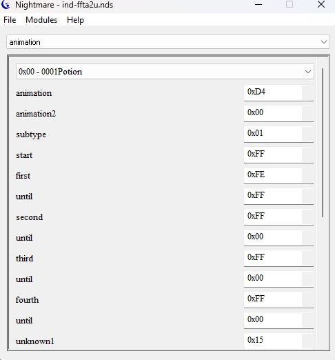

# Gastón Trombotti

Mi nombre es Gastón Trombotti. soy de la ciudad de Las Parejas, Santa Fe y cursó la carrera de
Tecnicatura de Programación de Videojuegos en la cohorte de Rosario.

Desde el 2003 trabajó en Contacto 100.9 (una radio local) en distintos roles en producción tanto delante como detrás de los micrófonos
Cursé por un tiempo la carrera de Licenciatura en Ciencias de la Computación en la Facultad de Ciencias Exactas, Ingeniería
y Agrimensura de la Universidad Nacional de Rosario, que no complete.
Al regresar, me sume a la productora "Visión Multimedios" como camarógrafo y también realizando trabajos ocasionales de edición
Actualmente me desempeño en ambas ocupaciones.

Siempre me gusto todo lo relacionado a la computación y principalmente a la programación e incluso a los 36 años
sigo aprendiendo cosas.

Formamos un muy buen grupo de trabajo con otros compañeros de la carrera y nos ayudamos los unos a los otros durante la cursada.

Visto que estoy cursando una carrera relacionada a ellos, es facil adivinar que los videojuegos son uno de mis principales 
pasatiempos, no solo en jugar pero en aprender como funcionan. Incluso e intentado algo de ROM hacking llegando a crear un 
pequeño modulo de edición de animación para utilizar en la aplicaciíón Nightmare para el titulo “Final Fantasy Tactics A2”

